# Trendpup - BlockDAG AI Memecoin Intelligence

**Advanced AI-powered memecoin intelligence system for BlockDAG blockchain with voice-enabled interaction, real-time analytics, and smart contract-gated access.**

## Supported Chains

- **BlockDAG Testnet/Mainnet** - High-performance DAG-based blockchain with fast, scalable transactions
- **Wallet Support** - RainbowKit, WalletConnect, and EVM-compatible wallets for BlockDAG
- **DEX Integration** - BlockDAG DEXs for real-time token data

## Key Features

- 🤖 **AI-Powered Analysis** - Advanced AI integration for sophisticated token evaluation
- 🎤 **Voice Interface** - Natural speech input and high-quality voice output
- 🔗 **BlockDAG Integration** - Native support for BlockDAG blockchain and BDAG tokens
- 📊 **Real-Time Data** - Live token tracking and social sentiment analysis
- 🛡️ **Scam Detection** - Advanced filtering to identify rugpulls and fake projects
- 💬 **Custom AI Agent** - Conversational AI made using custom agent API with retrieval-augmented generation
- 💸 **Smart Contract-Gated Access** - Subscription system using SimpleAccessFee contract on BlockDAG
- ⚡ **Fast Performance** - Leveraging BlockDAG's high-speed, scalable architecture
- 🔐 **Secure Wallet Integration** - Connect securely with RainbowKit and EVM wallets

## Our Memecoin Analysis Methodology

**Trendpup's AI-Powered Fundamental Analysis Framework**

Our system employs a comprehensive **5-Factor Risk Assessment Model** that prioritizes capital preservation while identifying legitimate opportunities. Here's how we analyze every memecoin on BlockDAG:

### 🚨 Critical Risk Factors We Assess

**1. LIQUIDITY HEALTH** 🏊‍♂️
- **Pool Size Analysis**: Tokens with <$50K liquidity flagged as HIGH RISK
- **Slippage Risk Assessment**: Low liquidity = difficulty selling without major price impact
- **Exit Strategy Viability**: Can you actually get your money out?
- **Volume-to-Liquidity Ratio**: High ratios (>5x) suggest potential manipulation

**2. AGE-BASED SECURITY** ⏰
- **Brand New (<24 hours)**: EXTREME RUG PULL RISK
- **Very New (<7 days)**: HIGH RISK - most rug pulls occur in this phase
- **Young (<30 days)**: MODERATE RISK - still establishing legitimacy
- **Established (>90 days)**: LOWER RISK - survived initial high-risk phases

**3. VOLATILITY PATTERNS** 📈📉
- **Extreme Volatility (>100% daily)**: Possible pump/dump scheme indicators
- **Manipulation Detection**: Sudden coordinated price movements
- **Healthy Volatility Range**: 20-50% daily for memecoins is normal
- **Technical Analysis**: Support/resistance level identification

**4. CONTRACT SECURITY** 🔒
- **Ownership Status**: Renounced contracts provide higher security
- **Hidden Functions**: Detection of honeypot, pause, or blacklist capabilities
- **Mint Authority**: Analysis of unlimited token creation risks
- **Audit Status**: Third-party security review verification

**5. COMMUNITY AUTHENTICITY** 👥
- **Organic Growth Verification**: Real engagement vs. bot activity detection
- **Developer Transparency**: Public team vs. anonymous developer assessment
- **Social Sentiment Analysis**: Genuine excitement vs. coordinated campaigns
- **Holder Distribution**: Concentration risk in few wallets

### 📊 Risk Assessment Framework

**Risk Levels (1-10 Scale):**
- **1-3: LOW RISK** - Established tokens with solid fundamentals
- **4-6: MEDIUM RISK** - Some concerns but manageable with proper position sizing
- **7-8: HIGH RISK** - Multiple red flags, very small positions only
- **9-10: EXTREME RISK** - Avoid entirely or exit immediately

**Potential Levels (1-10 Scale):**
- **8-10: HIGH POTENTIAL** - Strong fundamentals + compelling narrative + authentic community
- **5-7: MEDIUM POTENTIAL** - Some positive factors with moderate upside
- **1-4: LOW POTENTIAL** - Limited catalysts or declining metrics

### 🛡️ Position Sizing Recommendations

Our AI provides specific portfolio allocation guidance:
- **Low Risk (1-3)**: Up to 5-10% of portfolio allocation
- **Medium Risk (4-6)**: 2-5% of portfolio maximum
- **High Risk (7-8)**: 1-2% of portfolio maximum
- **Extreme Risk (9-10)**: Avoid entirely or <1% speculation only

### ⚠️ Automatic Red Flag Detection

Our system immediately warns users about:
- Zero or unknown liquidity data
- Daily price changes exceeding 200%
- Unverified or suspicious contract information
- Anonymous teams making unrealistic promises
- Sudden coordinated social media campaign patterns

### 🎯 Investment Philosophy

**Capital Preservation First**: We prioritize avoiding total loss over chasing maximum gains. Our philosophy: "Better to miss a 10x than lose everything on a rug pull."

**Our Analysis Helps Users:**
- Avoid total loss scenarios through comprehensive risk assessment
- Size positions appropriately based on individual risk profiles
- Identify genuine opportunities with long-term staying power
- Plan exit strategies before entering positions
- Make data-driven decisions rather than emotional trades

## Problem It Solves

An **AI-powered early detection system** specifically designed for **BlockDAG meme coins**, identifying **promising tokens before significant price movement** on a next-generation DAG-based blockchain ecosystem.

Our **smart contract-gated platform** provides **professional-grade memecoin intelligence** for BDAG, democratizing access to advanced trading insights with transparent, on-chain subscription.

## What Users Can Use It For

Our AI-powered system helps users:

- **Discover high-potential BlockDAG meme coins early** - before major price surges, giving retail investors a critical edge in the BDAG ecosystem.
- **Automate BlockDAG token monitoring** - eliminating the need to manually scan Telegram, Twitter, DEXs, and trackers across the BlockDAG ecosystem.
- **Filter scams and rugpulls** - using behavioral and on-chain analysis to detect red flags on BlockDAG, making trading safer.
- **Identify real community momentum** - distinguishing organic growth from paid shills or bot activity in the BlockDAG ecosystem.
- **Level the playing field** - by reducing information asymmetry traditionally exploited by insiders, whales, and snipers.
- **Enter earlier for maximum ROI** - ensuring users don't miss the small window of explosive growth most meme coins experience early on.
- **Voice-enabled AI interaction** - use natural speech to query markets, get analysis, and receive trading insights hands-free.
- **BlockDAG blockchain analysis** - leverage specialized AI understanding of BlockDAG's architecture for deeper insights.
- **Smart contract-gated access** - subscribe via SimpleAccessFee contract for premium features.

## AI Analysis Pipeline

## How It Improves the Status Quo

Traditional methods of discovering meme coins on BlockDAG and other chains have major flaws:

- Discovering tokens **after** the pump = missed profits  
- **Manual research** across DEXs wastes time and is error-prone  
- Hard to tell a **genuine project** from a scam in the rapidly evolving ecosystem  
- **Insiders and bots** always move first on new tokens  
- Most tools can't separate **real hype from fake** in the community  
- Retail traders often miss the **early-entry sweet spot** in the fast-growing ecosystem  
- **No specialized tools** for analyzing smart contracts and token mechanics
- **Expensive subscriptions** that don't deliver consistent value

Our system solves all of this with **transparent BDAG pricing** and **professional-grade AI memecoin intelligence** gated by smart contract subscription.

## Market Opportunity Analysis

## Trendpup System Architecture

## Technology Stack Overview

**Component Breakdown**

- **Hosting:**  
  Services are designed for cloud deployment with modern infrastructure.

- **Frontend (Next.js):**  
  Handles BlockDAG wallet connection and user interface.  
  Supports RainbowKit, WalletConnect, and EVM-compatible wallets.  
  Features voice input/output capabilities for hands-free AI interaction.  
  Smart contract-gated access to premium features.

- **Smart Contract (SimpleAccessFee):**  
  Deployed on BlockDAG testnet for transparent access control.  
  Handles BDAG payments for subscription periods.  
  Decentralized and auditable payment system.  
  Contract Address: `YOUR_BLOCKDAG_CONTRACT_ADDRESS_HERE`

- **Scraper:**  
  Scrapes BlockDAG DEXs for token data across multiple protocols.  
  Scrapes Twitter for token-related tweets and sentiment analysis.  
  Monitors BlockDAG ecosystem for emerging opportunities.

- **AI Analysis (Custom AI Models):**  
  Reads tweets and BlockDAG token data.  
  Determines risk score, investment potential, and provides rationale.  
  Specialized analysis for BlockDAG smart contracts and ecosystem dynamics.

- **Custom Agent (AI + RAG):**  
  Advanced AI agent with Retrieval-Augmented Generation.  
  Answers user queries with the latest BlockDAG token data and in-depth analysis.  
  Supports natural voice interaction and text-to-speech responses.

- **Voice Interface:**  
  Speech recognition for natural voice commands and queries.  
  High-quality text-to-speech with customizable voice selection.  
  Hands-free trading insights and market analysis.

- **Access Control System:**  
  Smart contract-based premium access control.  
  Transparent BDAG pricing for subscription.  
  Automatic access verification and time tracking.  
  Seamless wallet integration for payment processing.

- **BlockDAG Integration:**  
  Native support for BlockDAG smart contract analysis.  
  Integration with BlockDAG testnet for real-time blockchain data.  
  Multi-wallet support for seamless user experience.

## Feature Comparison Matrix

```mermaid
graph TB
    subgraph "Trendpup Features"
        A[✅ AI Analysis]
        B[✅ Voice Interface]
        C[✅ Scam Detection]
        D[✅ Smart Contract Analysis]
        E[✅ Real-time Data]
        F[✅ BDAG Fair Pricing]
        G[✅ Multi-wallet Support]
        H[✅ Early Detection]
    end
    
    subgraph "Traditional Tools"
        I[❌ Manual Research]
        J[❌ Text Only]
        K[❌ Basic Filtering]
    end
```

### Architecture Overview

**Backend Services (Node.js + Python Stack):**

- API server processes requests and coordinates data analysis
- Python AI agent provides intelligent token analysis and insights
- Web scrapers collect real-time data from BlockDAG DEXs and social media

**AI Infrastructure:**

- Modern AI models for advanced analysis and pattern recognition
- Speech recognition for voice input processing
- Text-to-speech synthesis for voice responses

**Data Integration:**

- Real-time scraping of BlockDAG DEX data and BDAG token metrics
- Social sentiment analysis from Twitter, Telegram, and other platforms
- On-chain analytics from BlockDAG blockchain data

## Why Trendpup vs. Traditional Tools?

```mermaid
graph LR
    subgraph "Trendpup Advantages"
        A[✅ Smart Contract-Gated Access]
        B[✅ Voice Interface] 
        C[✅ BlockDAG Native]
        D[✅ AI-Powered]
        E[✅ Real-time Data]
        F[✅ Multi-Wallet]
        G[✅ Early Detection]
        H[✅ Risk Assessment]
    end
    
    subgraph "Competitor Limitations"
        I[❌ Expensive Subscriptions]
        J[❌ Text-Only Interface]
        K[❌ No BlockDAG Support]
        L[❌ Manual Analysis]
        M[❌ Delayed Data]
        N[❌ $100+ Monthly]
        O[❌ Limited Wallets]
        P[❌ Late Discovery]
    end
    
    style A fill:#32cd32
    style B fill:#32cd32
    style C fill:#32cd32
    style D fill:#32cd32
    style E fill:#32cd32
    style F fill:#32cd32
    style G fill:#32cd32
    style H fill:#32cd32
    
    style I fill:#ff4444
    style J fill:#ff4444
    style K fill:#ff4444
    style L fill:#ff4444
    style M fill:#ff4444
    style N fill:#ff4444
    style O fill:#ff4444
    style P fill:#ff4444
```

**Summary:**  
Trendpup provides smart contract-gated, AI-powered memecoin intelligence for BlockDAG users through an innovative voice-enabled interface. The platform aggregates real-time blockchain and social data from the BlockDAG ecosystem, then leverages advanced AI models for investment analysis and conversational intelligence, all delivered through a modern Next.js frontend with comprehensive BlockDAG wallet integration and hands-free voice interaction capabilities.

---

## Success Metrics

*Trendpup - AI-powered BlockDAG memecoin intelligence, now with voice interaction and smart contract-gated access.*
